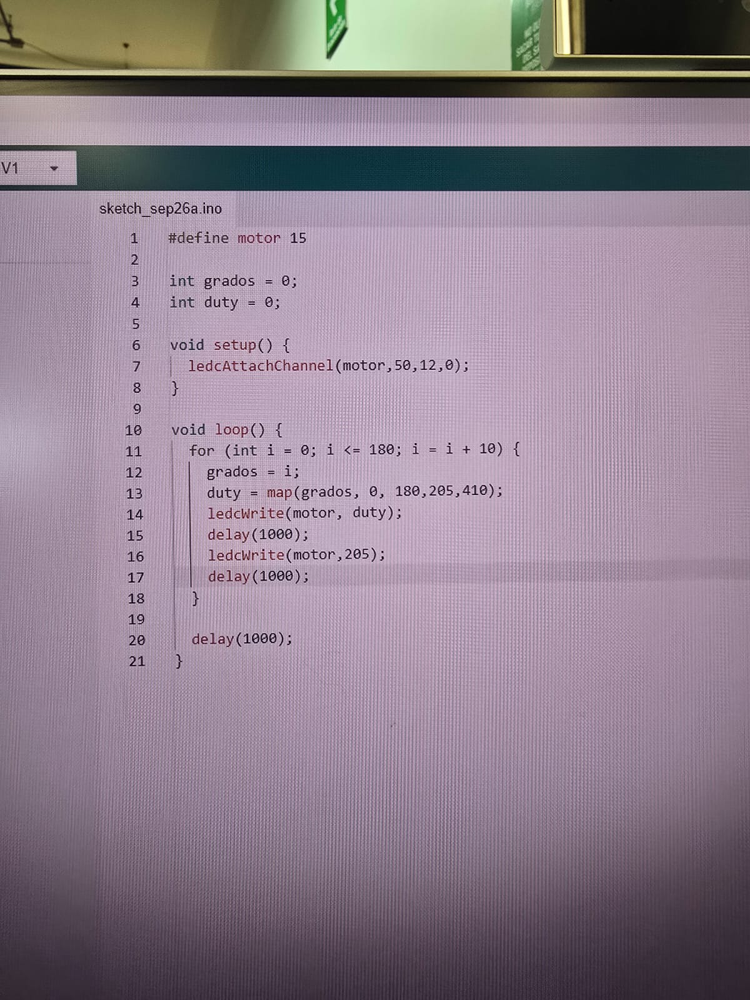

# Control de servomotores con ESP32

## Objetivo
Mover un micro servo tipo SG90/Steren con señales PWM de 50 Hz generadas por el ESP32, mapeando ángulos a pulsos de 1–2 ms y validando alimentación desde fuente DC de laboratorio. 

## Descripción rápida
- Un servo estándar usa 50 Hz: 1 ms ≈ 0°, 1.5 ms ≈ 90°, 2 ms ≈ 180°; la alimentación típica es ~5 V y requiere GND común con la señal. 
- El montaje muestra ESP32 + protoboard, servo micro y fuente GW Instek con canal ajustado a 12 V para laboratorio, mientras el servo recibe ~5 V regulados/USB y la señal desde un GPIO. 

## Materiales
- ESP32 DOIT DEVKIT V1.   
- Micro servo (Steren S07-180/SG90 equivalente). 
- Fuente GW Instek GPE‑3323 para pruebas y referencia de tierra; USB para lógica/5 V. 
- Protoboard y jumpers; cableado de tres hilos del servo: rojo=Vcc, café/negro=GND, naranja=señal. 

## Conexiones
1. Vcc del/los servos a 5 V regulados; nunca alimentar servos desde 3.3 V del ESP32. 
2. GND del 5 V de servos unido al GND del ESP32 y de la fuente (tierra común). 
3. Señal del servo a un GPIO del ESP32 (ejemplo GPIO 15); para dos servos usar dos GPIOs independientes. 

## Código

```python
#define SERVO1 15
int grados = 0;
int duty = 0;

void setup() {
  // Canal de 50 Hz y resolución de 12 bits (0–4095)
  ledcAttachChannel(SERVO1, 50, 12, 0);
}

void loop() {
  for (int i = 0; i <= 180; i += 10) {
    grados = i;
    // map 0–180° a ~1.0–2.0 ms en 20 ms (50 Hz) → ~205–410 ticks a 12 bits
    duty = map(grados, 0, 180, 205, 410);
    ledcWrite(SERVO1, duty);
    delay(1000);
  }
  delay(1000);
}
```


## Notas prácticas
- Si el servo tiembla: compartir GND, usar cables cortos y subir corriente disponible en 5 V; evitar alimentar desde el pin 5V del ESP32 si el consumo es alto.   
- Para varios servos: duplicar la conexión de Vcc y señal a distintos GPIOs y prever una fuente de 5 V dedicada con suficiente corriente. 

## Evidencias

 


 

> Video opcional:  
> [Video en plataforma externa](https://tu-enlace-de-video.com) 
